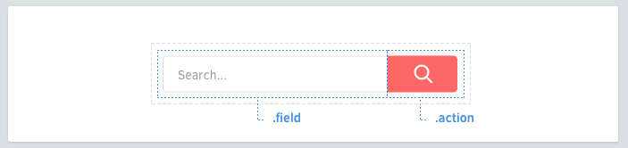

# Elementos

Elementos são coisas dentro do seu componente.



## Nomeando Elementos
Cada componente pode ter vários elementos. Elementos devem ter a classe definida com **uma palavra**.

```scss
.search-form {
  > .field { /* ... */ }
  > .action { /* ... */ }
}
```

## Seletores para elementos
Prefira usar o seletor de filho `>` sempre que possível. Isso previne que o estilo afete outros componentes aninhados e tem uma performance melhor do que os seletores de descendentes.

```scss
.article-card {
  .title     { /* okay */ }
  > .author  { /* ✓ better */ }
}
```

## Lidando com múltiplas palavras
Para aqueles que precisam de duas ou mais palavras, concatená-las sem traços ou underscores.

```scss
.profile-box {
  > .firstname { /* ... */ }
  > .lastname { /* ... */ }
  > .avatar { /* ... */ }
}
```

## Evite seletores de tag
Use classes sempre que possível. Seletores de tag são bons, mas eles tem uma performance menor e podem não ser tão descritivos assim.

```scss
.article-card {
  > h3    { /* ✗ avoid */ }
  > .name { /* ✓ better */ }
}
```

Nem todos os elementos são sempre iguais. Variantes podem ajudar.
[Continuar →](variants.md)
<!-- {p:.pull-box} -->
